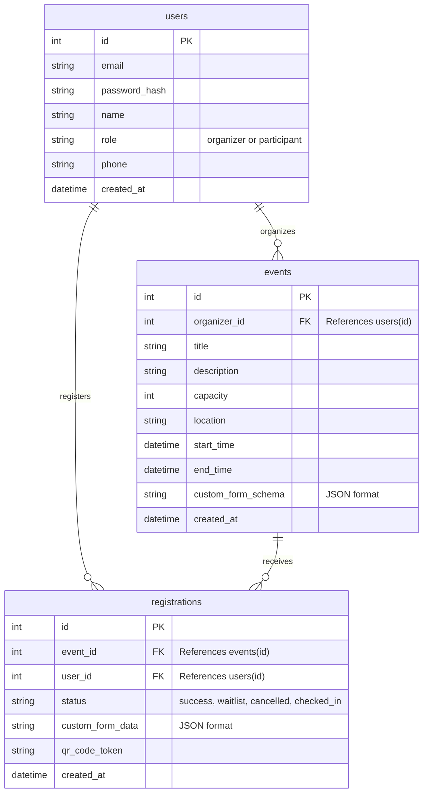

# 活動報名系統 資料庫設計文件 (DB Design)

## 1. ER 圖 (實體關係圖)

## 2. 資料表詳細說明

### `users` (使用者表)
儲存系統的使用者資料，包含活動主辦者與一般參加者。
- `id`: INTEGER PRIMARY KEY AUTOINCREMENT
- `email`: TEXT (必填, 唯一) - 登入帳號與聯絡信箱
- `password_hash`: TEXT (必填) - 加密後密碼
- `name`: TEXT (必填) - 使用者姓名
- `role`: TEXT (必填) - 區分 `organizer` (主辦方) 或是 `participant` (一般參加者)
- `phone`: TEXT (非必填) - 聯絡電話
- `created_at`: TEXT - 帳號建立時間 (ISO 格式)

### `events` (活動表)
主辦方建立的活動資訊。
- `id`: INTEGER PRIMARY KEY AUTOINCREMENT
- `organizer_id`: INTEGER (必填) - Foreign Key 關聯 `users(id)`
- `title`: TEXT (必填) - 活動名稱
- `description`: TEXT - 活動說明
- `capacity`: INTEGER (必填) - 名額上限
- `location`: TEXT (必填) - 地點
- `start_time`: TEXT (必填) - 開始時間 (ISO)
- `end_time`: TEXT (必填) - 結束時間 (ISO)
- `custom_form_schema`: TEXT - 儲存動態表單的 JSON 結構 (例如: 需收集學號、素食等)
- `created_at`: TEXT - 建立時間

### `registrations` (報名紀錄表)
參加者的報名與票券狀態。
- `id`: INTEGER PRIMARY KEY AUTOINCREMENT
- `event_id`: INTEGER (必填) - Foreign Key 關聯 `events(id)`
- `user_id`: INTEGER (必填) - Foreign Key 關聯 `users(id)`
- `status`: TEXT (必填) - `success`(報名成功), `waitlist`(候補), `cancelled`(取消), `checked_in`(已報到)
- `custom_form_data`: TEXT - 對應活動定義表單的使用者填寫資料 JSON
- `qr_code_token`: TEXT (唯一) - 簽到用的唯一驗證碼
- `created_at`: TEXT - 報名時間

## 3. SQL 建表語法
請見專案路徑 `database/schema.sql`。

## 4. Python Model 程式碼
請見 `app/models/` 目錄下的 Python 模組：
- `user.py`
- `event.py`
- `registration.py`
