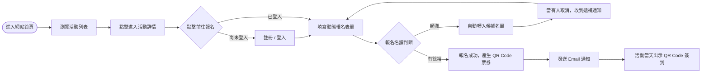
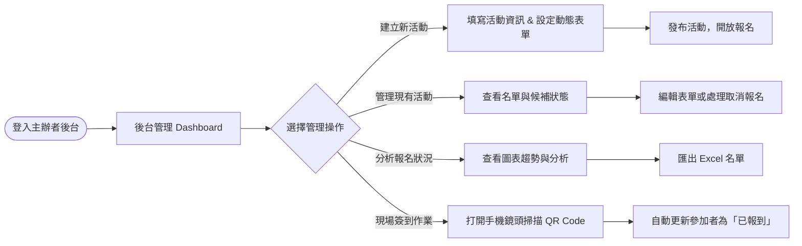
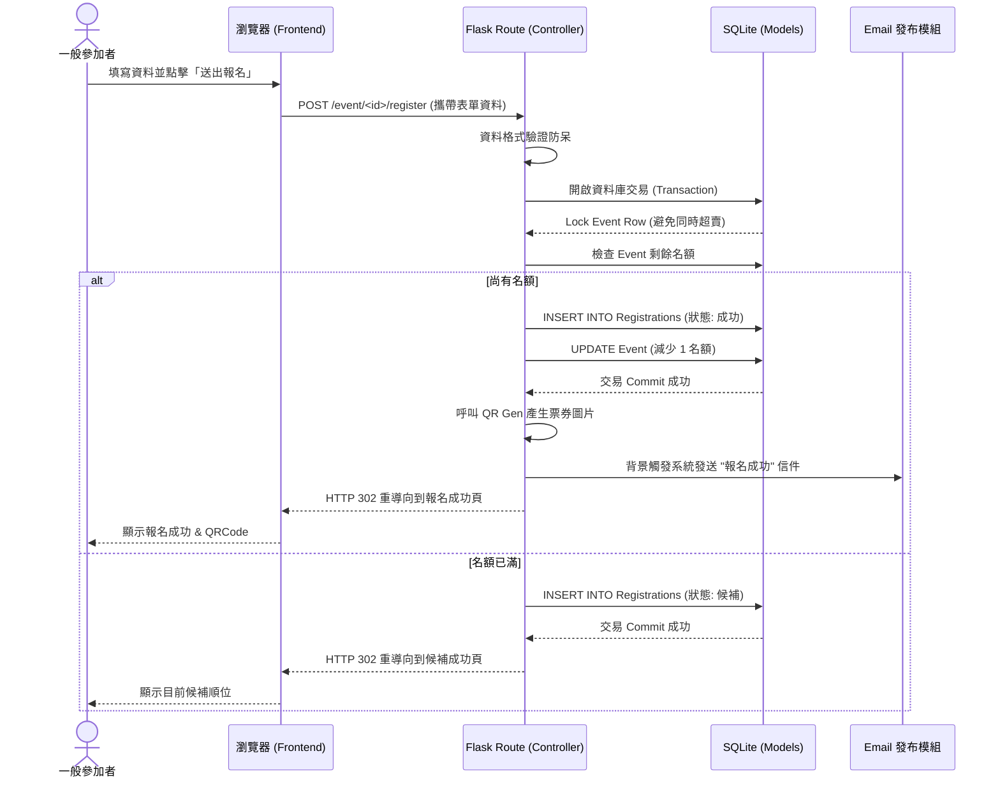

# 活動報名系統 流程圖 (Flowcharts)

本文件基於 PRD 與 ARCHITECTURE 設計，將系統的操作路徑與資料流視覺化。包含使用者流程圖、註冊報名流程的系統序列圖，以及系統功能對應的 URL 路徑清單。

## 1. 使用者流程圖 (User Flow)

展示「活動主辦者」與「一般參加者」在系統中的主要操作路線。

### 1-1. 一般參加者流程

### 1-2. 活動主辦者流程

---

## 2. 系統序列圖 (Sequence Diagram)

此序列圖展示一般參加者「送出報名表單」到「產生票券」之間，系統前後端的資料流運作過程。其中包含了高併發情況下的簡單鎖定機制確保名額不超賣。

---

## 3. 功能清單對照表

列出系統主要功能及其對應的 URL 路徑與 HTTP 操作方法（路由規劃）。

| 功能描述 | HTTP 方法 | URL 路徑 (Endpoint) | 負責元件 / 對應的操作 |
| --- | --- | --- | --- |
| 瀏覽首頁活動列表 | `GET` | `/` | 顯示所有開放中活動 |
| 註冊會員 | `GET` / `POST`| `/auth/register` | 會員註冊頁面 / 送出註冊資料 |
| 會員登入 | `GET` / `POST`| `/auth/login` | 會員登入頁面 / 送出登入驗證 |
| 建立新活動 (主辦方) | `GET` / `POST`| `/events/create` | 新增活動表單頁 / 寫入新活動 |
| 檢視活動詳情 | `GET` | `/events/<event_id>` | 取得該活動的詳細資訊介紹 |
| 報名活動 (參加方) | `GET` / `POST`| `/events/<event_id>/register` | 選填動態欄位表單 / 送出報名或候補 |
| 活動管理儀表板 | `GET` | `/dashboard/<event_id>` | 分頁呈現名單總覽與視覺化圖表 |
| 匯出報名名單 | `GET` | `/events/<event_id>/export` | 使用者下載 Excel 格式檔案 |
| QR Code 現場簽到 | `POST` | `/events/<event_id>/check-in` | 掃描後送出請求更改用戶為「已簽到」 |
